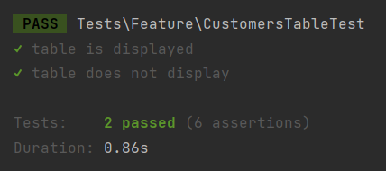
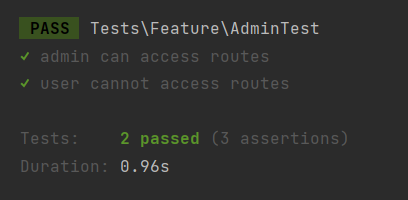

# Testing Assignment

## User Story 1
**Analysis**
- User Story: As the logistics manager, I want to see the list of customers, so that I can check if their invoices went through.
- Happy Path: **Given** I am a logistics manager **When** I go to the customers page **Then** I should see a list of customers.
- Sad Path: **Given** I am a logistics manager **When** I go to the customers page **Then** I do not see the list of customer **And** the tables are emptied.
- V-Model Link: The CustomersList component has a search input field that is bound to the searchQuery data property using v-model. The searchQuery data property will reflect the current value of the search input, and any changes made to the input will automatically update the searchQuery value. This allows the logistics manager to filter the customer list based on their search input.

**Design**
- The customers page will be a table that displays the list of customers.
- The customers page will be in the navbar.
- The data will be display using an API call to the database, so is harder that a CRUD.

**Implementation**
- I created a new test called CustomerTest
- The test checks if there is a customers page.
- The test checks if the customers page has a table.

**Testing**
- System Tests **Happy Path**: The logistics manager logs into the dashboard. Then he goes to the customers page in the navbar and he sees the list of customers.
- System Tests **Sad Path**: The logistics manager logs into the dashboard. Then he goes to the customers page in the navbar and he sees an empty table.
- Unit Tests: Verify the differentiation between admin and normal user roles, ensuring that the appropriate access privileges are granted.
- V-model: By incorporating system tests and unit tests at appropriate stages, the V-model ensures that the system is thoroughly tested for different scenarios, including the happy and sad paths, while also verifying the differentiation between admin and normal user roles.
- Why some parts are not tested: We are not testing if the data is correct, since this test focuses on verifying that the table is being displayed. In addition, we would have to request specific data from the API, and validate if it is shown in the table. Which will make the test more complex and more spread out.

**Completed Test**

**Evaluation**
- The test can check if the customers page exists, if there is a table being displayed or not and if the table contains data.
- The test cannot check if the table is displaying the right information, which would be a mistake too.
- We can conclude that the test quality satisfies the project need to verify that the customers' page displays a table. However, it will also be a good idea to check manually if the table data is accurate.
- Improvement: We can add a test to check if the table is displaying the right information based on an API call.

## User Story 2
**Analysis**
- User Story: As the logistics manager, I want to have an admin account, so that I can modify the routes of the trucks.
- Happy Path: **Given** I am a logistics manager **When** I go to the routes page **Then** I can modify the routes of the trucks.
- Sad Path: **Given** I am a logistics manager **When** I go to the routes page **Then** I cannot modify the routes of the trucks **And** I get a 403 error.
- V-Model Link: By linking the "isAdmin" property to v-model, the application manages the logistics manager's access level, allowing or denying them the ability to modify the routes of the trucks based on their admin account role status.

**Design**
- The routes page will be a table that displays the list of routes.
- The routes page will be in the admin dropdown.
- The admin dropdown will only be visible to the admin account.
- A middleware will be created to check if the user is an admin or not.
- The routes should be blocked for normal users.

**Implementation**
- I created a new test called AdminTest
- The test checks if the admin account can access the routes page.
- The test checks if the normal account can access the routes page.

**Testing**
- System Tests **Happy Path**: The logistics manager with an admin account. Logs into the dashboard and goes to the routes page in the admin dropdown. Then is able to see and modify the routes page.
- System Tests **Sad Path**: Another user with a normal account log in. Types in the url /routes, and he receives a 403 error.
- Unit Tests: User roles and permissions.
- V-Model: The system tests and unit tests align with the development stages to validate the behavior of the RoutesPage component, user roles, and permissions, as specified in the user story.
- Why some parts are not tested: We are not testing if the admin is able to modify the routes, since this test focuses on verifying that the permissions are working correctly. In addition, the CRUD operations were already tested manually when they were developed.

**Completed Test**

**Evaluation**
- The test can check if the normal user does not have access to the routes page and receives a 403 error code. It also checks, if the admin is able to access the page with a 200 response.
- The test cannot check if the admin can modify the routes page, or if the edit and create route blades are blocked for normal users.
- We can conclude that the test successfully verifies that different accounts have different permissions. A normal user cannot access the routes page, which is exactly what the client asked for. However, the test does not fully verify that a normal user cannot modify the routes, nor if the admin can modify them.
- Improvement: We can add a test to check if the admin can modify the routes page, and another test to validate that the create and edit pages are blocked for normal users.
